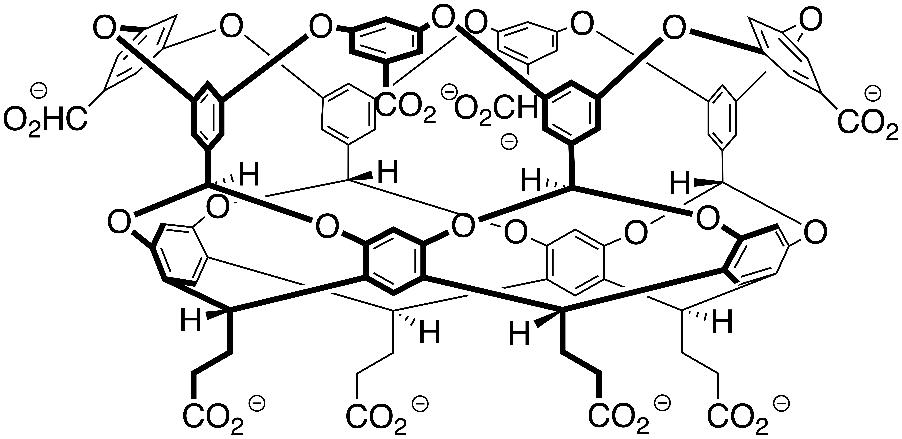
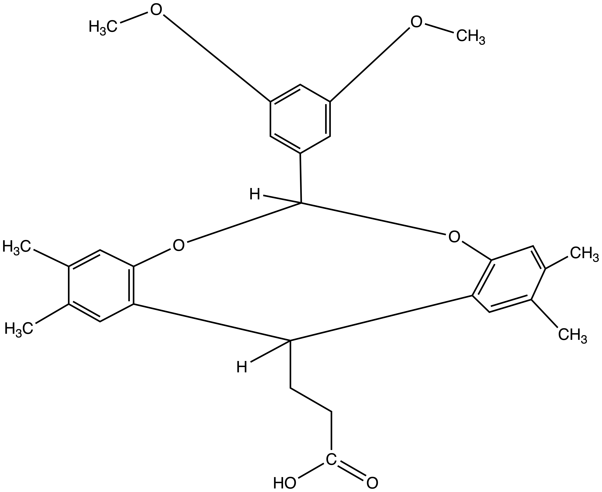
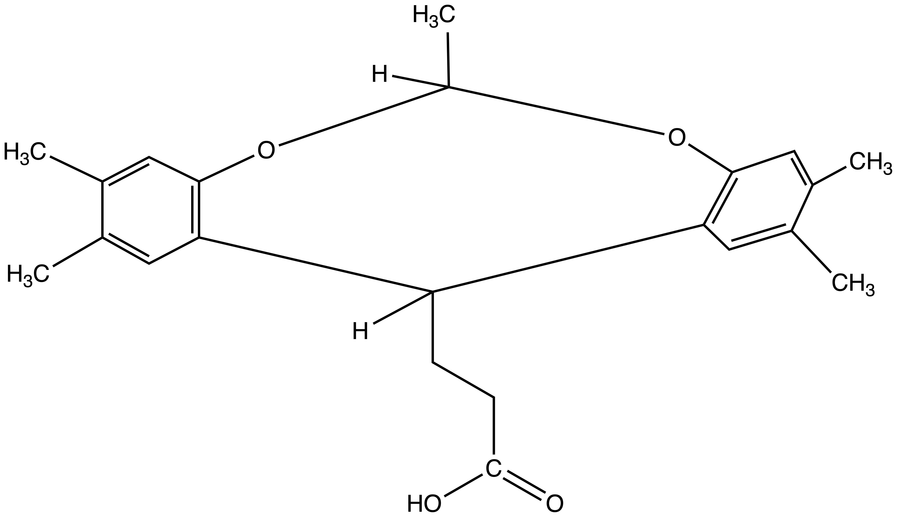
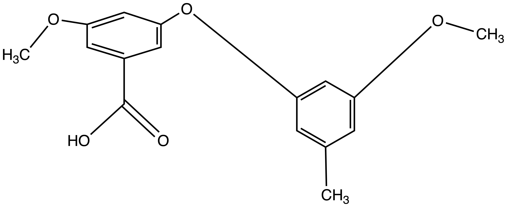

# What's here

#### View of the whole OA host

#### View of the OA fragments
| Fragment 1 | Fragment 2 | Fragment 3 | Fragment 4 |
| :-----------: | :------------: | :------------: | :------------: |
|     |      |        |    |

## Directory
- [`OA-original.sdf`](OA-original.sdf) and [`exoOA-original.sdf`](exoOA-original.sdf) - Host files taken from the [OA](https://github.com/samplchallenges/SAMPL7/blob/master/host_guest/GDCC_and_guests/host_files/OA.sdf) and [exo-OA](https://github.com/samplchallenges/SAMPL7/blob/master/host_guest/GDCC_and_guests/host_files/exoOA.sdf) hosts for the [SAMPL7 GDCC Challenge](https://github.com/samplchallenges/SAMPL7/tree/master/host_guest/GDCC_and_guests/host_files).
- [`SAMPL7_hosts.cdx`](SAMPL7_hosts.cdx) ChemDraw file of the OA and exo-OA hosts. File taken from the [SAMPL7 GDCC Challenge](https://github.com/samplchallenges/SAMPL7/tree/master/host_guest/GDCC_and_guests/host_files).
- [`fragments.csv`](fragments.csv) - A `.csv` file that contains fragment id's and smiles strings. Smiles strings were generated by copying the fragment contained in each `.cdxml` file in the [`OA-chemdraw-fragments`](OA-chemdraw-fragments/) folder as a smiles string.
- [`OA-chemdraw-fragments/`](OA-chemdraw-fragments/) - Chemdraw files of OA fragments. In `.cdxml` file format.
- [`images/`](images/) - Images of the fragments. Created by exporting chemdraw files as .png files.
